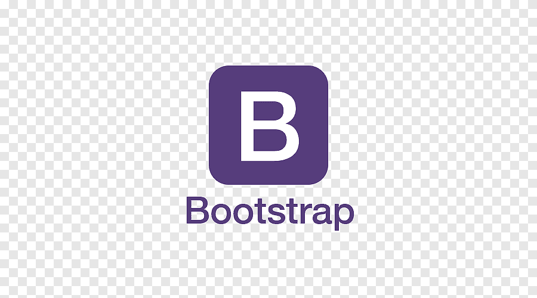
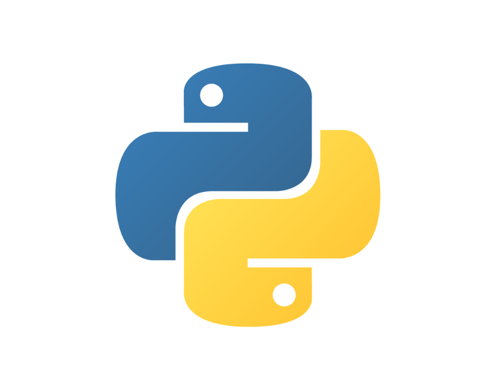

<!DOCTYPE html>
<html lang="en">
<head>
    <meta charset="UTF-8">
    <meta name="viewport" content="width=device-width, initial-scale=1.0">
    
</head>
<body style="font-family: 'Segoe UI', Tahoma, Geneva, Verdana, sans-serif; line-height: 1.6; max-width: 800px; margin: 0 auto; padding: 20px;">
    

        <h1 style="color: #2d3748;">👨‍💻 Egor Gapeev - Web Developer & AI Enthusiast</h1>
        
🎯 Hello! I'm a beginner web developer passionate about creating innovative solutions and exploring artificial intelligence.

    

    

        <h2 style="color: #4a5568; border-bottom: 2px solid #e2e8f0; padding-bottom: 8px;">🎓 Education</h2>
        

            <h4 style="color: #4a5568; margin-top: 5px;">🏫 College at AltSU, Barnaul, Russia</h4>
            
📚 Web and Multimedia Applications Developer (4th year student)

        

    

    

        <h2 style="color: #4a5568; border-bottom: 2px solid #e2e8f0; padding-bottom: 8px;">🛠️ Technical Skills</h2>
        

            
 HTML5

            
 CSS3

            
 TypeScript

            
 PHP

            
 SQL

            
 Tailwind CSS

            
 Bootstrap

            
 jQuery

            
 React

            
 Python

        

    

    

        <h2 style="color: #4a5568; border-bottom: 2px solid #e2e8f0; padding-bottom: 8px;">📜 Certifications & Courses</h2>
        

            <ul style="padding-left: 20px;">
                <li style="margin-bottom: 8px;">🎯 Introduction to Artificial Neural Networks (<a style="color: #3182ce; text-decoration: none;" href='assets/stepik/stepik_1.pdf'>certificate</a>)</li>
                <li style="margin-bottom: 8px;">📊 Fundamentals of Statistics (<a style="color: #3182ce; text-decoration: none;" href='assets/stepik/stepik_2.pdf'>certificate</a>)</li>
                <li style="margin-bottom: 8px;">🐍 FastAPI Python Quick Start (<a style="color: #3182ce; text-decoration: none;" href='assets/stepik/stepik_3.pdf'>certificate</a>)</li>
                <li style="margin-bottom: 8px;">🤖 Machine Learning (<a style="color: #3182ce; text-decoration: none;" href='assets/stepik/stepik_4.pdf'>certificate</a>)</li>
            </ul>
        

    

    

        <h2 style="color: #4a5568; border-bottom: 2px solid #e2e8f0; padding-bottom: 8px;">📱 Contact Information</h2>
        

            

                ✉️ Telegram: 
                <a style="color: #3182ce; text-decoration: none;" href='https://t.me/egor_gapeev'>@egor_gapeev</a>
            

            

                📧 Gmail: 
                <a style="color: #3182ce; text-decoration: none;" href='mailto:gapeev.105s9@gmail.com'>gapeev.105s9@gmail.com</a>
            

        

    

    

        <h2 style="color: #4a5568; border-bottom: 2px solid #e2e8f0; padding-bottom: 8px;">🏆 Hackathon Participation</h2>
        

            <h4 style="color: #4a5568; margin-top: 5px;">🚀 Case: Copilot for GeekBrains Curator/Support Specialist (26-28 Apr 2024)</h4>
            
💡 Developed a chatbot using ML algorithms to analyze student queries and provide contextual responses

            
👥 <strong>Role:</strong> Frontend Developer

            
🏅 <strong>Result:</strong> TOP-4

            
🔗 <strong>Materials:</strong> 
                <a style="color: #3182ce; text-decoration: none;" href='https://github.com/VladDyshlyuk/geekbrains-second-pilot-awildsheepchase'>Solution</a> | 
                <a style="color: #3182ce; text-decoration: none;" href='assets/hackaton/certificate.pdf'>Certificate</a>
            

        

        

            <h4 style="color: #4a5568; margin-top: 5px;">💼 Case: QnA Bot for Tinkoff Business Support (31 May - 2 Jun 2024)</h4>
            
🤖 Created generative AI assistant for business queries using Tinkoff's knowledge base

            
👥 <strong>Role:</strong> Frontend Developer

            
🏅 <strong>Result:</strong> TOP-5

            
🔗 <strong>Materials:</strong> 
                <a style="color: #3182ce; text-decoration: none;" href='https://github.com/VladDyshlyuk/hacks-ai-tinkoff-bot-awildsheepchase'>Solution</a> | 
                <a style="color: #3182ce; text-decoration: none;" href='assets/hackaton/certificate2.pdf'>Certificate</a>
            

        

    

    

        <h2 style="color: #4a5568; border-bottom: 2px solid #e2e8f0; padding-bottom: 8px;">💻 Projects</h2>
        

            <h4 style="color: #4a5568; margin-top: 5px;">👟 SneakerMax - E-commerce Website</h4>
            
🛠️ <strong>Tech Stack:</strong> 
                HTML
                CSS
                JavaScript
            

            
🔗 <strong>GitHub:</strong> 
                <a style="color: #3182ce; text-decoration: none;" href='https://github.com/GapeevE/sneakerMax'>View Project</a>
            

        

    

</body>
</html>
