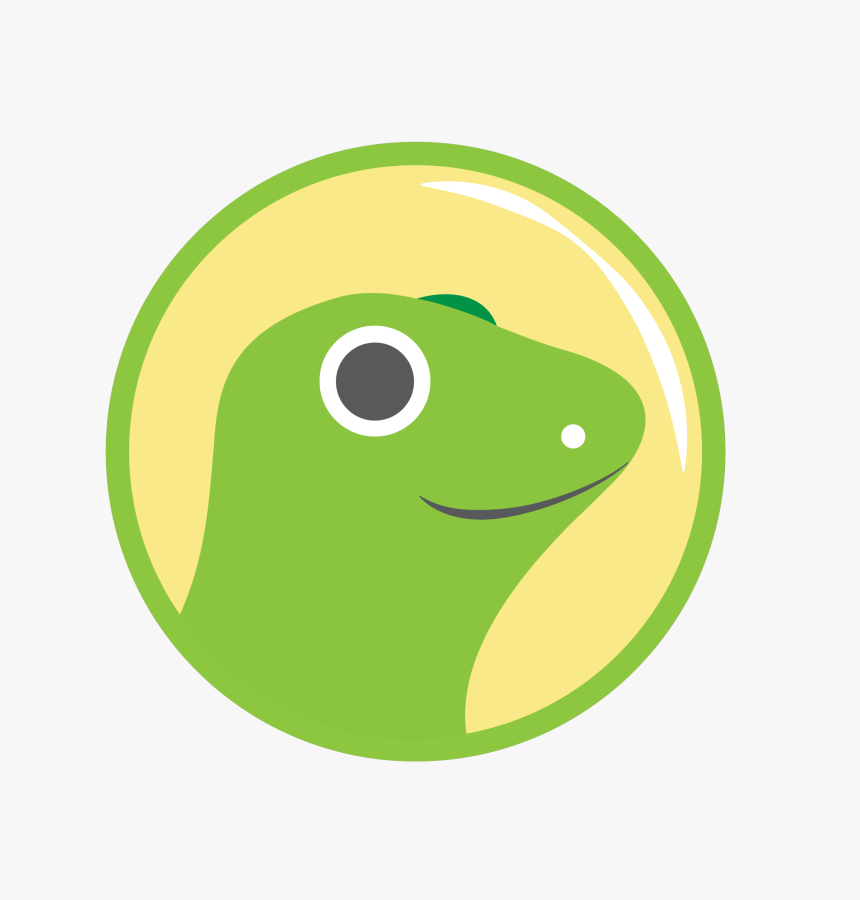

<!DOCTYPE html>
<html lang="en">
<head>
    <meta charset="UTF-8">
    <meta name="viewport" content="width=device-width, initial-scale=1.0">
    
</head>
<body style="font-family: 'Segoe UI', Tahoma, Geneva, Verdana, sans-serif; line-height: 1.6; max-width: 800px; margin: 0 auto; padding: 20px;">
    

        <h1 style="color: #2d3748;">👨‍💻 Egor Gapeev - Web Developer & AI Enthusiast</h1>
        
🯠Hello! I'm a beginner web developer passionate about creating innovative solutions and exploring artificial intelligence.

    

    

        <h2 style="color: #4a5568; border-bottom: 2px solid #e2e8f0; padding-bottom: 8px;">🎓 Education</h2>
        

            <h4 style="color: #4a5568; margin-top: 5px;">🏫 AltSU College, Barnaul, Russia</h4>
            
📚 09.02.07 Information Systems and Programming (Web and Multimedia Applications Developer)

        

    

    

        <h2 style="color: #4a5568; border-bottom: 2px solid #e2e8f0; padding-bottom: 8px;">🛠️ Technical Skills</h2>
        

            

                <h5>Frontend</h5>
                
 HTML5

                
 CSS3

                
 TypeScript

                
 Tailwind CSS

                
 Bootstrap

                
 jQuery

                
 React

            

            

                <h5>Backend</h5>
                
 PHP

                
 Node.js

                
 SQL

            

            

                <h5>AI/Data Science</h5>
                
 Python

            

        

    

    

        <h2 style="color: #4a5568; border-bottom: 2px solid #e2e8f0; padding-bottom: 8px;">📜 Certifications & Courses</h2>
        

            <ul style="padding-left: 20px;">
                <li style="margin-bottom: 8px;">🎯 Introduction to Artificial Neural Networks (<a style="color: #3182ce; text-decoration: none;" href='assets/stepik/stepik_1.pdf'>certificate</a>)</li>
                <li style="margin-bottom: 8px;">📊 Fundamentals of Statistics (<a style="color: #3182ce; text-decoration: none;" href='assets/stepik/stepik_2.pdf'>certificate</a>)</li>
                <li style="margin-bottom: 8px;">🐍 FastAPI Python Quick Start (<a style="color: #3182ce; text-decoration: none;" href='assets/stepik/stepik_3.pdf'>certificate</a>)</li>
                <li style="margin-bottom: 8px;">🤖 Machine Learning (<a style="color: #3182ce; text-decoration: none;" href='assets/stepik/stepik_4.pdf'>certificate</a>)</li>
            </ul>
        

    

    

        <h2 style="color: #4a5568; border-bottom: 2px solid #e2e8f0; padding-bottom: 8px;">📱 Contact Information</h2>
        

            

                ✉️ Telegram: 
                <a style="color: #3182ce; text-decoration: none;" href='https://t.me/egor_gapeev'>@egor_gapeev</a>
            

            

                📧 Gmail: 
                <a style="color: #3182ce; text-decoration: none;" href='mailto:gapeev.105s9@gmail.com'>gapeev.105s9@gmail.com</a>
            

        

    

    

        <h2 style="color: #4a5568; border-bottom: 2px solid #e2e8f0; padding-bottom: 8px;">🏆 Hackathon Participation</h2>
        

            <h4 style="color: #4a5568; margin-top: 5px;">🚀 Case: Copilot for GeekBrains Curator/Support Specialist (26-28 Apr 2024)</h4>
            
💡 Developed a chatbot using ML algorithms to analyze student queries and provide contextual responses

            
👥 <strong>Role:</strong> Frontend Developer

            
🅠<strong>Result:</strong> TOP-4

            
🔗 <strong>Materials:</strong> 
                <a style="color: #3182ce; text-decoration: none;" href='https://github.com/VladDyshlyuk/geekbrains-second-pilot-awildsheepchase'>Solution</a> | 
                <a style="color: #3182ce; text-decoration: none;" href='assets/hackaton/certificate.pdf'>Certificate</a>
            

        

        

            <h4 style="color: #4a5568; margin-top: 5px;">💼 Case: QnA Bot for Tinkoff Business Support (31 May - 2 Jun 2024)</h4>
            
🤖 Created generative AI assistant for business queries using Tinkoff's knowledge base

            
👥 <strong>Role:</strong> Frontend Developer

            
🅠<strong>Result:</strong> TOP-5

            
🔗 <strong>Materials:</strong> 
                <a style="color: #3182ce; text-decoration: none;" href='https://github.com/VladDyshlyuk/hacks-ai-tinkoff-bot-awildsheepchase'>Solution</a> | 
                <a style="color: #3182ce; text-decoration: none;" href='assets/hackaton/certificate2.pdf'>Certificate</a>
            

        

    

    

        <h2 style="color: #4a5568; border-bottom: 2px solid #e2e8f0; padding-bottom: 8px;">💻 Projects</h2>
        

            <h4 style="color: #4a5568; margin-top: 5px;">Crypto Brains</h4>
            
🛠️ <strong>Tech Stack:</strong> 
                 React
                 Tailwind CSS
                 TypeScript
                 CoinGecko API
            

            
🔗 <strong>GitHub:</strong> 
                <a style="color: #3182ce; text-decoration: none;" href='https://github.com/GapeevE/CryptoBrains'>View Project</a>
                🔗 <strong>Live Demo:</strong> 
                <a style="color: #3182ce; text-decoration: none;" href='https://crypto-brains.vercel.app/'>View Demo</a>
            

            
🛠️ <strong>Description:</strong>
                Real-time cryptocurrency price monitoring with 3D visualization.
            
 
            <ul>🛠️ <strong>Features:</strong>
                <li>Responsive design</li>
                <li>D3.js data visualization</li>
                <li>Live API data updates</li>
                <li>Interactive charts</li>
            </ul>
        

        

            <h4 style="color: #4a5568; margin-top: 5px;">Telegram Bot with RAG-based AI for University Applicants Assistance</h4>
            
🛠️ <strong>Tech Stack:</strong> 
                 Python
                 FastAPI
                 Ollama
                 LangChain
                 Chroma DB
                 Beautiful Soup
            

            
🔗 <strong>GitHub:</strong> 
                <a style="color: #3182ce; text-decoration: none;" href='https://github.com/GapeevE/ai-chatbot-asu'>View Project</a>
            

            
🛠️ <strong>Description:</strong>
                System scrapes university website data, processes it, and stores in vector DB. LLM generates contextual responses using RAG architecture.
            
 
            <ul>🛠️ <strong>Features:</strong>
                <li>Document vectorization and storage</li>
                <li>k-NN semantic search</li>
                <li>Contextual response generation</li>
                <li>Telegram API integration</li>
            </ul>
        

        

            <h4 style="color: #4a5568; margin-top: 5px;">RUMTIBET</h4>
            
🛠️ <strong>Tech Stack:</strong> 
                 HTML5
                 CSS3
                 JS
                 jQuery
            

            
🔗 <strong>GitHub:</strong> 
                <a style="color: #3182ce; text-decoration: none;" href='https://github.com/GapeevE/rumTibet'>View Project</a>
                🔗 <strong>Live Demo:</strong>
                <a style="color: #3182ce; text-decoration: none;" href='https://gapeeve.github.io/rumTibet/'>View Demo</a>
            

            
🛠️ <strong>Description:</strong>
                Responsive landing page with interactive travel information.
            
 
            <ul>🛠️ <strong>Features:</strong>
                <li>Mobile-first design</li>
                <li>Animated sliders</li>
                <li>Modal windows and forms</li>
                <li>Multimedia integration</li>
            </ul>
        

        

            <h4 style="color: #4a5568; margin-top: 5px;">Tortotoro - Pastry Shop Management System</h4>
            
🛠️ <strong>Tech Stack:</strong> 
                 HTML5
                 CSS3
                 JS
                 PHP
                 MySQL
            

            
🔗 <strong>GitHub:</strong> 
                <a style="color: #3182ce; text-decoration: none;" href='https://github.com/GapeevE/Tortotoro'>View Project</a>
            

            
🛠️ <strong>Description:</strong>
                CRM for staff management, shift scheduling, and order tracking.
            
 
            <ul>🛠️ <strong>Features:</strong>
                <li>Employee administration</li>
                <li>Shift management</li>
                <li>Real-time order tracking</li>
                <li>Secure data handling</li>
                <li>Error logging</li>
            </ul>
        

    

</body>
</html>
